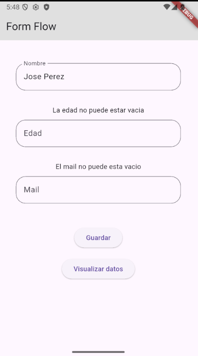
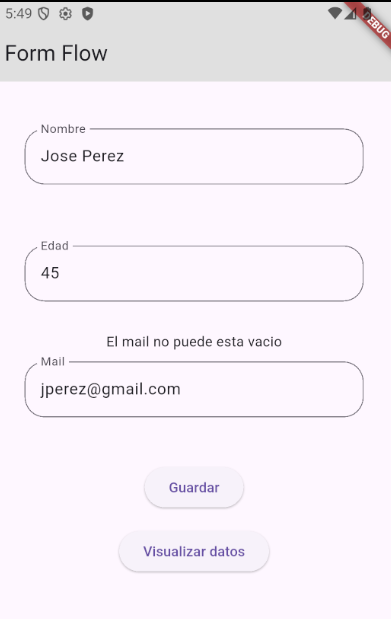
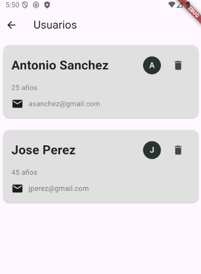

# formflow

## Descripción

FormFlow es una aplicación de ejemplo creada en Flutter para aprender y demostrar conceptos clave de desarrollo de apps móviles, enfocándose en validación de formularios, manejo de listas dinámicas y navegación entre pantallas.

## Características

- Formulario con validación de campos (nombre, edad y mail)
- Guardado de usuarios en una lista dinámica
- Pantalla de usuarios mostrando Cards con nombre, edad, mail y avatar
- Navegación entre pantallas
- Uso de widgets reutilizables (MyTextField)
- Interfaz sencilla y clara para demostrar jerarquía de widgets

## Capturas

## Conceptos aprendidos

- StatefulWidget y setState
- ListView.builder y manejo de listas dinámicas
- Widgets interactivos: ElevatedButton, IconButton, CircleAvatar
- Navegación entre pantallas y paso de datos
- Validación de datos y manejo de errores
- Widgets reutilizables
- Jerarquía visual: Column, Row, Padding, SizedBox
